# SparkDeck product manual

SparkDeck is a local-first control plane for discovering, downloading, serving, comparing, and measuring models across one or more NVIDIA DGX Spark systems. The browser interface can be opened from any joined node, while one controller remains authoritative for cluster membership and management.

> [!NOTE]
> Every screenshot in this manual comes from SparkDeck's deterministic dummy-data environment. Names, temperatures, storage totals, model performance, and other values are illustrative and are not measured DGX Spark results.

For a first installation, start with the [two-node QuickStart](../QUICKSTART.md).

## Contents

- [Core cluster concepts](#core-cluster-concepts)
- [Dashboard](#dashboard)
- [Explore](#explore)
- [Models](#models)
- [Cluster](#cluster)
- [Switch](#switch)
- [Chat](#chat)
- [Compare](#compare)
- [Benchmarks](#benchmarks)
- [Usage](#usage)
- [Images](#images)
- [Storage](#storage)
- [Settings](#settings)
  - [Interface](#interface)
  - [DGX Spark cluster](#dgx-spark-cluster-settings)
  - [Hugging Face access](#hugging-face-access)
  - [RouterOS switch](#routeros-switch-settings)
  - [Community Features](#community-features)
  - [Support and legal](#support-and-legal)
  - [Software update](#software-update)
- [Logs](#logs)
- [Mobile navigation](#mobile-navigation)

## Core cluster concepts

- **Entry node:** the SparkDeck process whose URL is open in your browser.
- **Controller:** the one node that owns cluster membership and coordinates management work.
- **Joined node:** a worker that runs assigned work and forwards management requests to the controller.
- **Per-machine membership:** pairing one machine does not import other machines that it previously controlled. Join every physical machine separately.
- **Alternate entry, not failover:** an online worker URL opens the same controller-managed cluster, but workers do not automatically become controllers if the controller goes offline.
- **Node-targeted work:** downloads, image pulls, deployments, and model-weight transfers are assigned to explicit nodes.
- **Local-first data:** operational state, settings, credentials, detailed benchmark history, and prompts and responses sent to managed local deployments stay on the systems you control. A configured external OpenAI-compatible endpoint receives its prompts and returns its responses outside those systems. Community sharing is optional and separately disclosed.

## Dashboard

The Dashboard is the cluster command center. Its local CPU, GPU, temperature, memory, and request telemetry comes from the controller. Opening SparkDeck through a joined worker still forwards these management requests to the controller; the worker URL does not make that worker the local telemetry source. Paired-node status remains listed separately rather than being combined into misleading cluster totals.

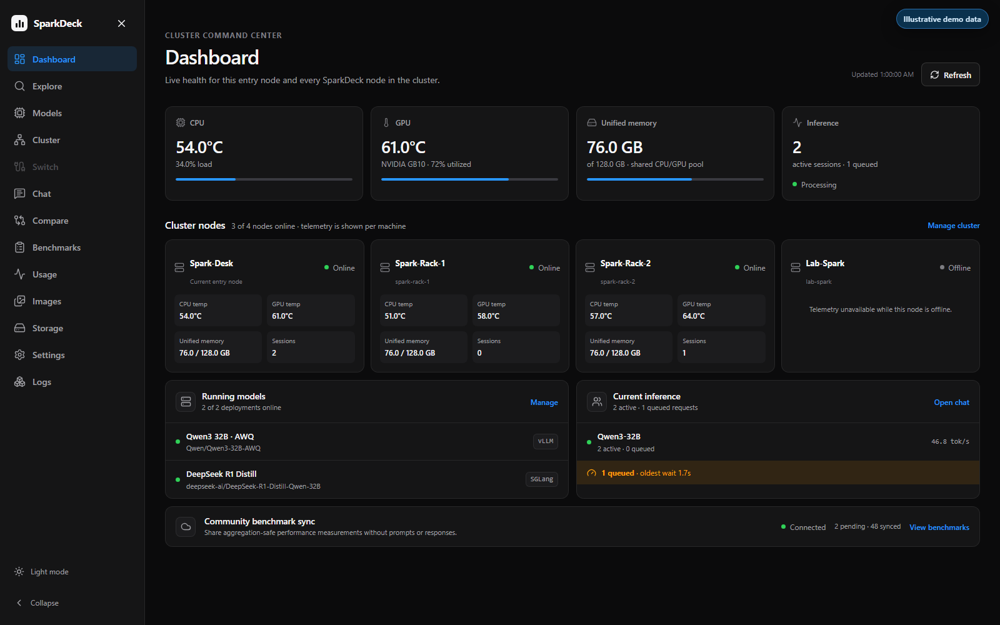

Use it to:

- check CPU and GPU temperatures;
- inspect GPU utilization and unified-memory allocation;
- see online and offline cluster members;
- find active and queued inference requests;
- jump to running models, Chat, Cluster, or Benchmarks; and
- see high-level community account and sharing status.

Use **Benchmarks** to verify synchronization health, including missing upload credentials or an invalid account token; the Dashboard's high-level status is not a complete upload-health check.

An offline node keeps its last known identity, but live telemetry is shown as unavailable. A running model can continue serving if the controller becomes unavailable, although cluster management is unavailable until the controller returns.

## Explore

Explore searches the Hugging Face catalog and helps decide what to download.

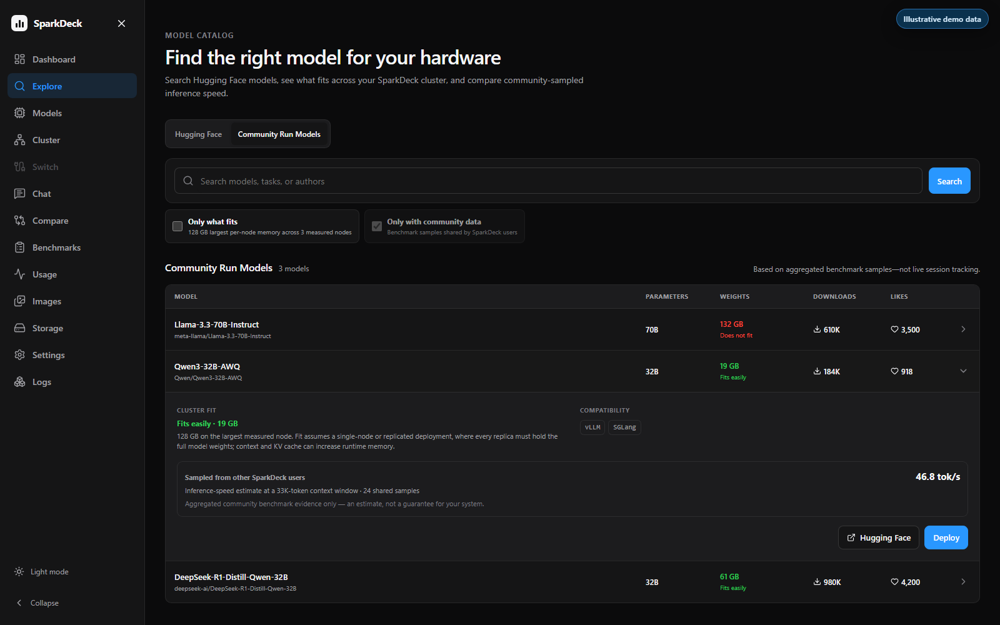

The page provides:

- **Hugging Face** and **Community Run Models** views;
- model name, author, parameter count, estimated weight size, downloads, and likes;
- expandable rows for runtime compatibility and deployment actions;
- **Only what fits**, based on measured per-node cluster memory;
- **Only with community data**, available when Community Features are enabled; and
- fit colors: green for comfortable fit, orange for tight fit, and red when the weights do not fit.

When matching community data exists, SparkDeck displays an inference-speed estimate for the exact model name and context-window size together with the number of shared samples. It is phrased as sampled from other SparkDeck users and is an estimate, not a guarantee.

## Models

Models manages saved deployment configurations and active model servers for vLLM, llama.cpp `llama-server`, and SGLang.

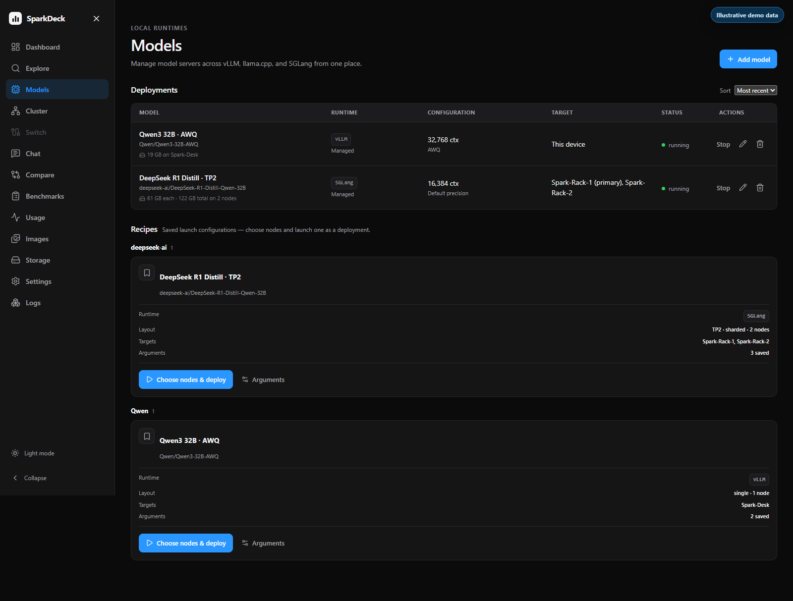

Use it to:

- create an active deployment with **Add model**;
- pin saved launch recipes and edit their launch arguments and controls;
- choose eligible nodes and deploy a saved recipe;
- start, stop, rename, or remove deployment records;
- connect an existing OpenAI-compatible endpoint;
- select the node or nodes that should run a deployment;
- require the correct number of eligible nodes for tensor parallelism; and
- inspect runtime, model identity, state, target nodes, configuration, and actions.

**Add model** creates a deployment record; it does not create a saved recipe. The current interface does not create, duplicate, or delete saved recipes.

For a TP2 configuration, SparkDeck requires two selected nodes. Nodes without the necessary cached weights are disabled until the weights are downloaded or transferred there.

## Cluster

Cluster onboards machines over Tailscale and manages recognizable node names.

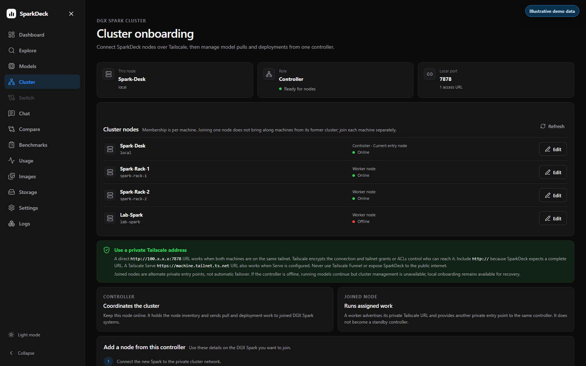

The page shows:

- the current node's identity and role;
- private access URLs and local port;
- online and offline members;
- editable names for any cluster node;
- removal for non-entry workers, including explicit offline recovery;
- a one-time pairing code; and
- the form used on a new machine to join an existing controller.

An online removal first tells the worker to revoke the old controller credential and become a standalone controller. **Forget node** is an offline recovery action: it removes only the controller's stale record, so the unreachable machine must later use **Leave cluster** or join again locally.

Pairing codes are temporary credentials. Do not place them in screenshots, support requests, chat messages, or committed files.

## Switch

Switch integrates supported MikroTik devices running RouterOS 7.x.

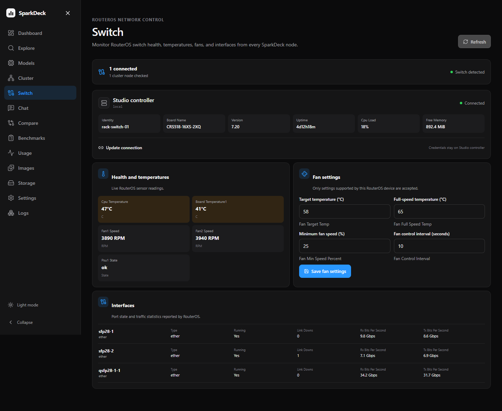

Depending on the switch model and RouterOS capabilities, SparkDeck can show:

- device identity, version, uptime, CPU load, and free memory;
- temperatures, voltage, power, and fan speed;
- supported fan target, full-speed, minimum-speed, and interval settings; and
- interface state, link downs, and receive/transmit traffic.

Automatic MNDP discovery works only on the local Layer-2 network. Routed networks and many Tailscale layouts require a manually entered private RouterOS HTTPS URL. SwOS is not supported because it does not expose the RouterOS REST API.

## Chat

Chat sends a conversation to one running deployment through SparkDeck's OpenAI-compatible proxy.

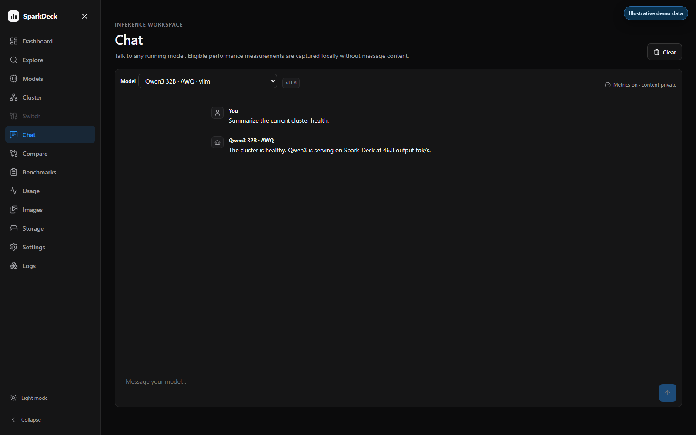

Use the deployment selector to choose a running model, enter a message, and inspect the response. SparkDeck records eligible timing and token measurements but does not store prompt or response content in benchmark telemetry.

Requests sent directly to a runtime's own port bypass SparkDeck, so they do not enter SparkDeck's queue, idle tracking, Usage counters, or benchmark history.

## Compare

Compare sends the same prompt to two running deployments and displays their results side by side.

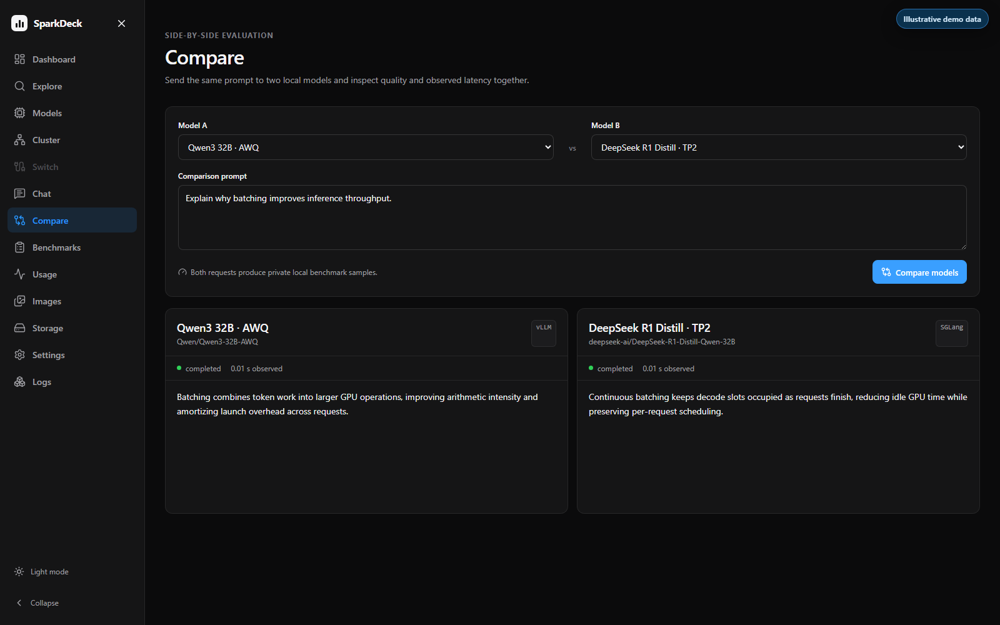

Use it for qualitative comparisons and observed latency checks. The two deployments can use different models, runtimes, quantizations, or settings. With managed local deployments, prompts and results stay on the systems you control. If either selection is a user-configured external OpenAI-compatible endpoint, SparkDeck sends that prompt to the external provider and receives the generated response from it; review that provider's privacy terms before use. SparkDeck benchmark records contain operational measurements, not the prompt or generated text.

## Benchmarks

Benchmarks organizes measurements captured through SparkDeck and, when enabled, privacy-preserving community estimates.

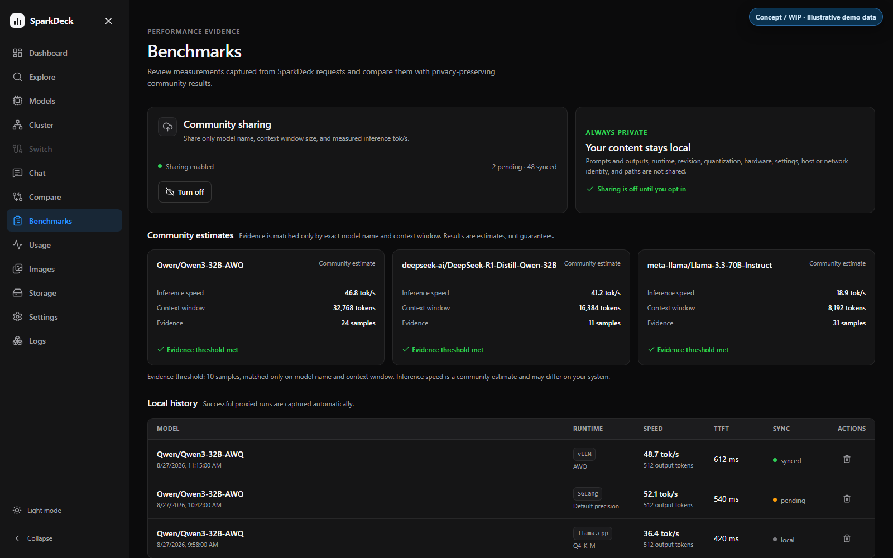

The page includes:

- coordinated runs grouped by model;
- prompt and generation throughput across context windows and C1, C2, C5, and C10 concurrency;
- tensor-parallel filters;
- local run history with runtime, quantization, speed, time to first token, and sync state;
- explicit community-sharing consent; and
- estimates matched by exact model name and context window.

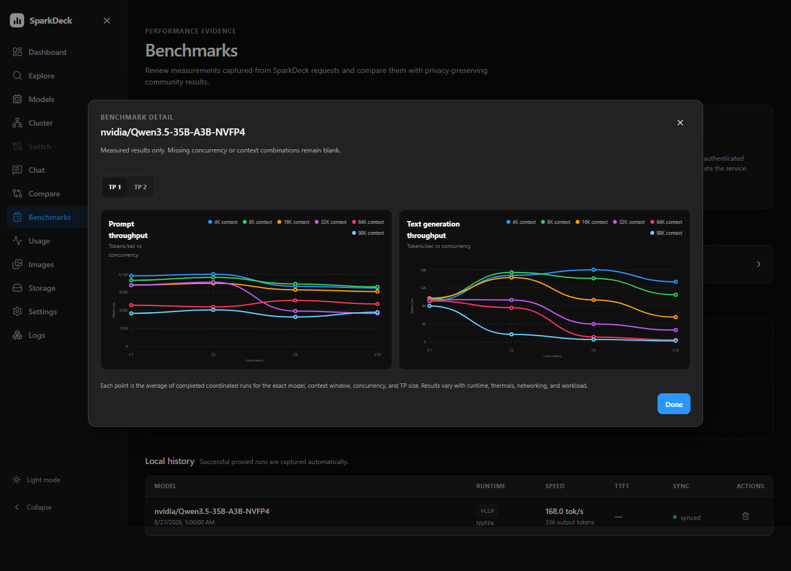

Community benchmark JSON includes the model identifier, context-window size, and measured inference tok/s. Coordinated runs also include request concurrency and, when recorded, tensor-parallel size. Prompts and outputs are never included. Turning sharing off stops future uploads and removes unsent uploads; it does not delete local benchmark history or recall already received data.

## Usage

Usage combines accounting from paired nodes without discarding each node's raw counters.

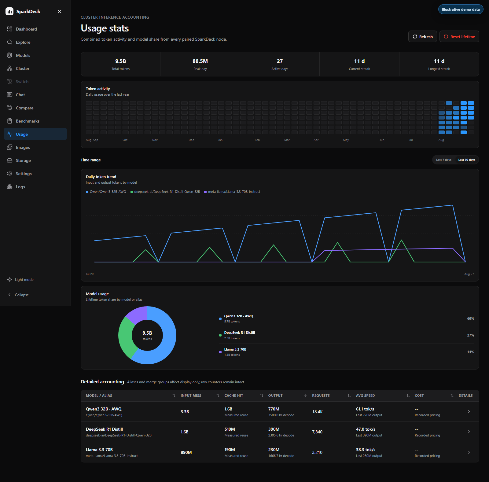

It provides:

- lifetime token and request totals;
- peak-day, active-day, current-streak, and longest-streak summaries;
- a one-year daily activity heatmap;
- 7-day and 30-day trend charts;
- lifetime model or alias share; and
- sortable detailed accounting for input misses, cache hits, output, requests, average speed, and configured cost.

Aliases and merge groups change how rows are presented; they do not rewrite the underlying counters. **Reset lifetime** is destructive and should be used only when the stored accounting is no longer needed.

## Images

Images inventories runtime container images across the cluster.

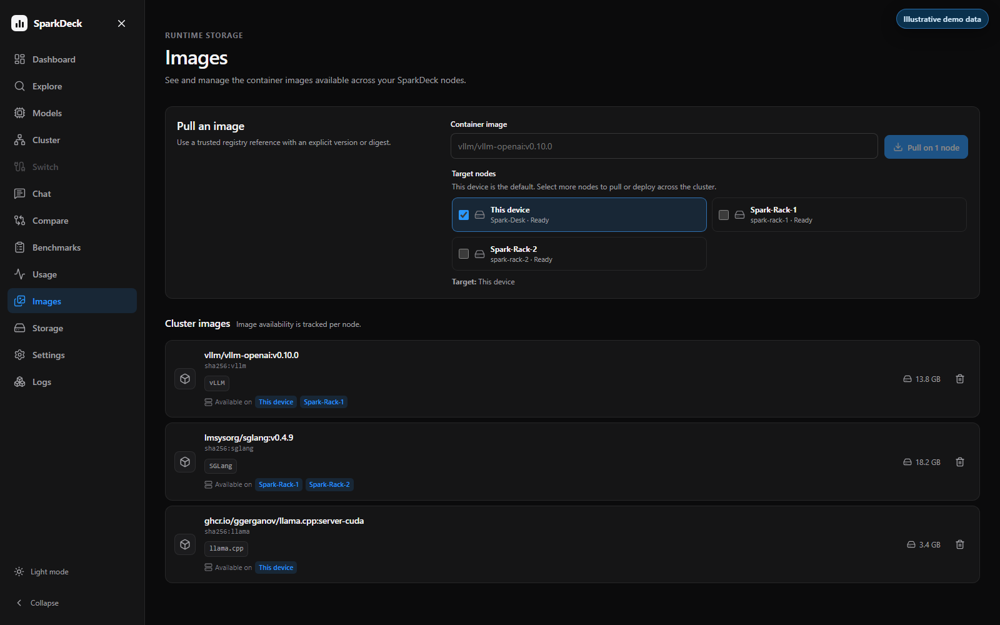

Use it to:

- pull a trusted registry image by explicit tag or digest;
- select exactly which nodes should download it;
- see image size, runtime compatibility, and per-node availability; and
- remove images that are not used by a deployment.

An image pull is not the same as a Hugging Face model download. Runtime images contain serving software; model weights are managed through Explore, Models, and Storage.

## Storage

Storage is SparkDeck's opt-in Virtual NAS for complete Hugging Face cache entries.

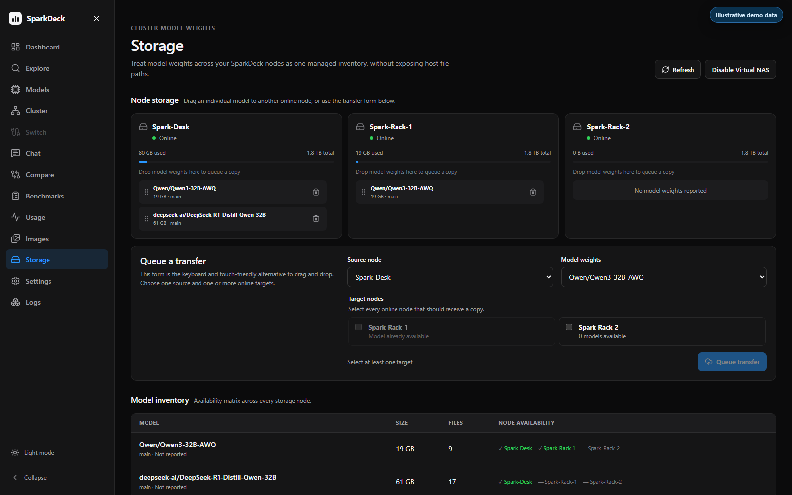

Use it to:

- see model identity, size, file count, and node availability;
- drag model weights from one node card to another on desktop;
- use the keyboard- and touch-friendly transfer form on any device;
- send one cached model to multiple online target nodes;
- monitor and cancel active transfer jobs, then manually re-queue a failed or cancelled transfer when needed; and
- delete one node's copy without affecting copies on other nodes.

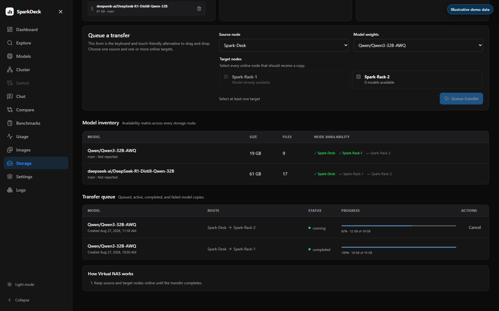

Virtual NAS does not expose arbitrary directories or local cache paths. Deletion is refused while a model is serving or involved in an active transfer. Keep both nodes online and verify enough free space before copying large weights.

## Settings

Settings contains browser preferences, cluster-wide credentials and integrations, community access, legal information, and coordinated software updates.

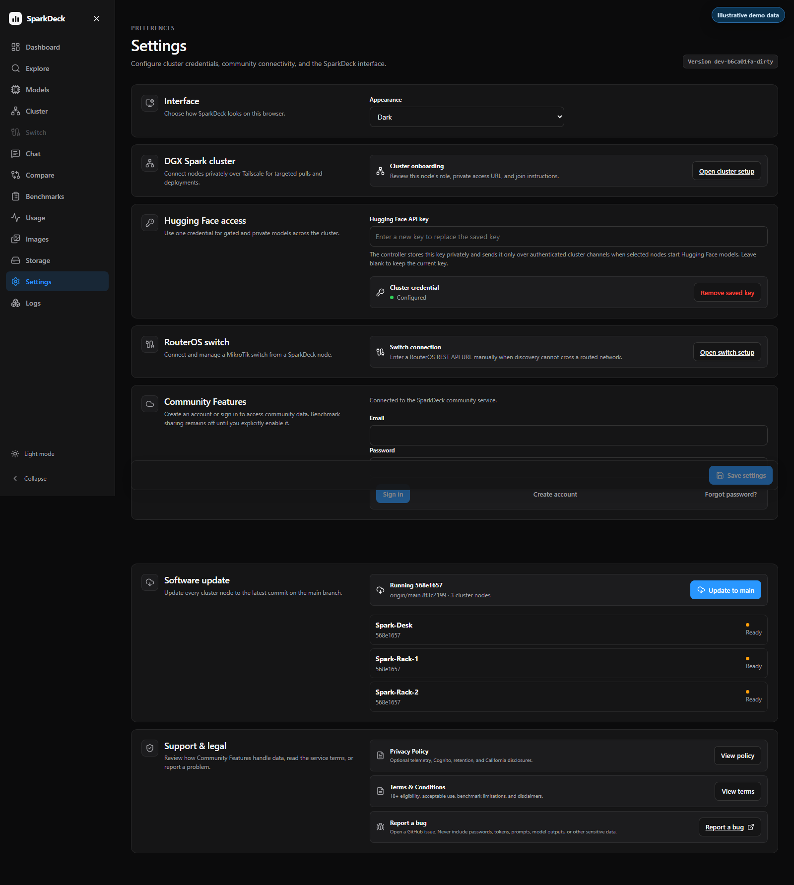

The **Save settings** button is enabled only after an editable value changes or a new Hugging Face token is entered.

### Interface

Choose **Follow system**, **Light**, or **Dark**. The selection is saved on the SparkDeck controller and becomes the loaded theme for browsers connected to that controller. The theme toggle at the bottom of the left navigation changes and persists the same controller setting.

### DGX Spark cluster settings

Open Cluster onboarding and review private-network guidance. Cluster membership itself is managed on the Cluster tab, not by editing hidden files.

### Hugging Face access

Save or clear the Hugging Face token used for gated and private repositories. The interface reports only whether a token is configured; it never returns the stored value to the browser.

### RouterOS switch settings

Open the Switch page to discover or configure a RouterOS device. RouterOS credentials stay on the selected SparkDeck node and are omitted from API responses.

### Community Features

Create an account, confirm the email address, sign in, reset a password, or sign out. Community data becomes available only after the signed-in user also explicitly enables benchmark sharing on Benchmarks; signing in alone does not grant access.

### Support and legal

Open the Privacy Policy and Terms & Conditions or create a GitHub issue. The privacy disclosure distinguishes local SparkDeck data from information processed by optional hosted Community Features.

### Software update

Update the whole cluster to the immutable commit currently at `origin/main`. SparkDeck preflights all nodes, updates workers one at a time, and updates the controller last. Offline nodes, dirty checkouts, unknown revisions, or unmanaged service layouts can block the coordinated update. SparkDeck does not expose arbitrary branches, release selection, or downgrade controls.

## Logs

Logs shows redacted application and runtime activity from the controller's SparkDeck service. Opening the UI through a joined worker still forwards this request to the controller; it does not show that worker's local service logs.

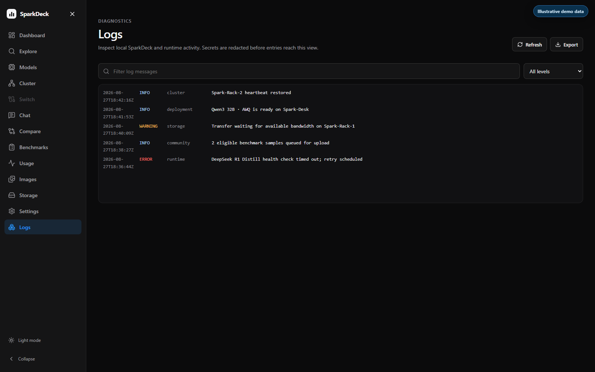

Use the free-text search and severity selector to narrow the list. Refresh to fetch new entries and **Export** to download the visible diagnostic set. Review an export before sharing it even though SparkDeck redacts recognized secrets.

## Mobile navigation

At mobile widths, the left navigation becomes a drawer opened from the top bar. Tables become stacked, touch-friendly rows; forms collapse to one column; and Storage provides a transfer form so drag-and-drop is never required. Press Escape, select a destination, or use the close control to dismiss the drawer.
